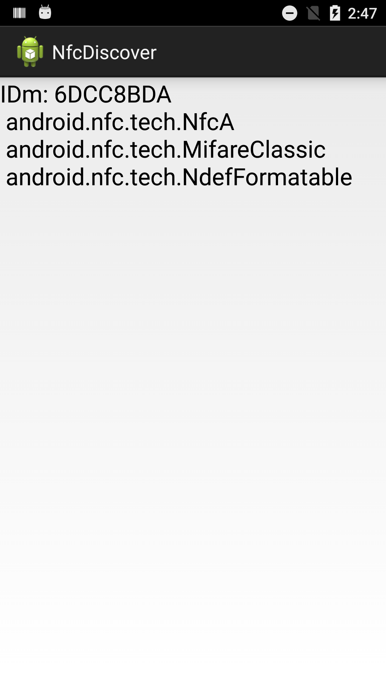
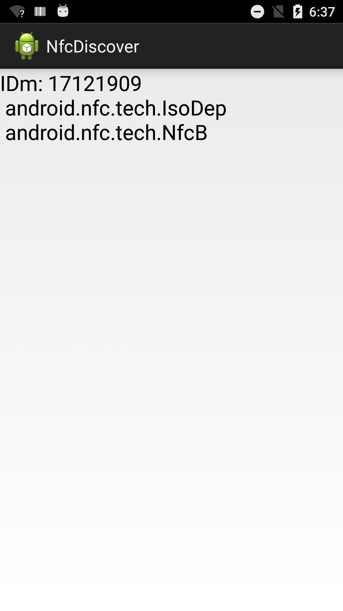

Android NfcDiscover Sample
===================================

This sample demonstrates how to discover IDm and tag tech of an NFC card.

Activity is launched by "android.nfc.action.TAG_DISCOVERED".

nfc tech filter
-----------------

    <tech-list>
        <tech>android.nfc.tech.IsoDep</tech>
        <tech>android.nfc.tech.MifareClassic</tech>
        <tech>android.nfc.tech.MifareUltralight</tech>
        <tech>android.nfc.tech.Ndef</tech>
        <tech>android.nfc.tech.NdefFormatable</tech>
        <tech>android.nfc.tech.NfcA</tech>
        <tech>android.nfc.tech.NfcB</tech>
        <tech>android.nfc.tech.NfcBarcode</tech>
        <tech>android.nfc.tech.NfcF</tech>
        <tech>android.nfc.tech.NfcV</tech>
    </tech-list>

Screenshots
--------------

